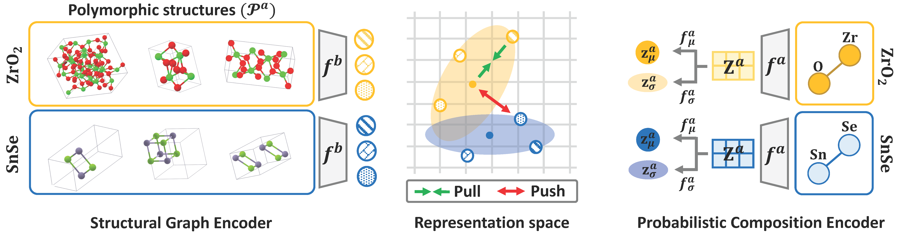

# Learning Probabilistic Compositional Representation of Materials


## Overview
Machine learning (ML) has seen promising developments in materials science, yet its efficacy largely depends on detailed crystal structural data, which are often complex and hard to obtain, limiting their applicability in real-world material synthesis processes. 
An alternative, using compositional descriptors, offers a simpler approach by indicating the elemental ratios of compounds without detailed structural insights. 
However, accurately representing materials solely with compositional descriptors presents challenges due to polymorphism, where a single composition can correspond to various structural arrangements, creating ambiguities in its representation.
To this end, we introduce PCRL, a novel approach that employs probabilistic modeling of composition to capture the diverse polymorphs from available structural information.
Extensive evaluations on sixteen datasets demonstrate the effectiveness of PCRL in learning compositional representation, and our analysis highlights its potential applicability of PCRL in material discovery.

</img> 

**Overall model architecture. While the structural graph encoder obtains a deterministic structural representation of crystal, the probabilistic composition encoder learns to represent each composition as a parameterized probabilistic distribution by acquiring mean and diagonal covariance matrices.Both encoders are jointly trained with soft contrastive loss in representation space.**

## Requirements
```
- Python 3.7.1
- Pytorch 1.8.1
- torch-geometric 1.7.0
- pymatgen 2022.0.17
- mendeleev 0.7.0
```

## Data Preparation

### Training dataset
We build training dataset consists of the materials and its properties which are collected from [Materials Project](https://materialsproject.org/).
We converted raw files to `mp.pkl` file and made create training data with `build_train_data.py` file.


### Test dataset

**[Step 1]** Download test datasets as given in the Table.

|Dataset | URL  |
|---|---|
|Band Gap | [Predicting the band gaps of inorganic solids by machine learning](https://pubs.acs.org/doi/10.1021/acs.jpclett.8b00124) |
|Formation Entalphies | [Experimental formation enthalpies for intermetallic phases and other inorganic compounds](https://figshare.com/collections/Experimental_formation_enthalpies_for_intermetallic_phases_and_other_inorganic_compounds/3822835)|
|Metallic | [Machine Learning Materials Datasets](https://figshare.com/articles/dataset/MAST-ML_Education_Datasets/7017254)  |
|ESTM 300 K & 600 K| [A public database of thermoelectric materials and system-identified material representation for data-driven discovery](https://www.nature.com/articles/s41524-022-00897-2)  |
|Matbench Datasets| [Benchmarking materials property prediction methods: the matbench test set and automatminer reference algorithm](https://github.com/anthony-wang/CrabNet/tree/master/data/matbench_cv)  |


**[Step 2]** Preprocess the downloaded datasets with `build_test_data.py` file.

## How to Run the Code


### To train the model

**[Option 1]** Train model with shell script
```
sh ./sh/train_PCRL.sh
```

**[Option 2]** Train model without shell script

```
python train.py
```

Following hyperparameters can be passed to `train.py`

`--lr`: Learning rate for training PCRL. Default is 5e-05.

`--hidden dim`: Hidden dimension in encoders. Default is 200.

`--epochs`: Total epochs for training PCRL. Default is 100.

`--batch_size`: Batch size (Number of materials) for training PCRL. Default is 256.

`--no_node_feature`: Choose not to use additional node features for crystal structural graph. If set to `True`, model will not use the additional feature. 
Throughout all our experiments, we deliberately avoid the use of any extra node features to exclusively assess the benefits of employing structural information.
Default is True. 

`--n_samples`: Number of samples from latent distribution of composition ($J$ in Equation 4). Default is 8.

`--negative scale` : Initial value for learnable parameter for scaling Euclidean distance ($c$ in Equation 4). Default is 20.

`--shift`: Initial value for learnable parameter for shifting Euclidean distance ($d$ in Equation 4). Default is 20. 

`--vib`: Controls the weight of KL divergence loss ($\beta$ in Equation 6). Default is 1e-08.

`--grad_clip`: Whether to clip gradients for more stable training of PCRL. Default is True.

### To test the model

We provided trained weights for PCRL and baseline methods in `model_checkpoints/` directory.

**[Option 1]** Test model with shell script

```
sh ./sh/test_PCRL.sh
```

**[Option 2]** Test model without shell script

```
python test_representation.py
python test_transfer.py
```